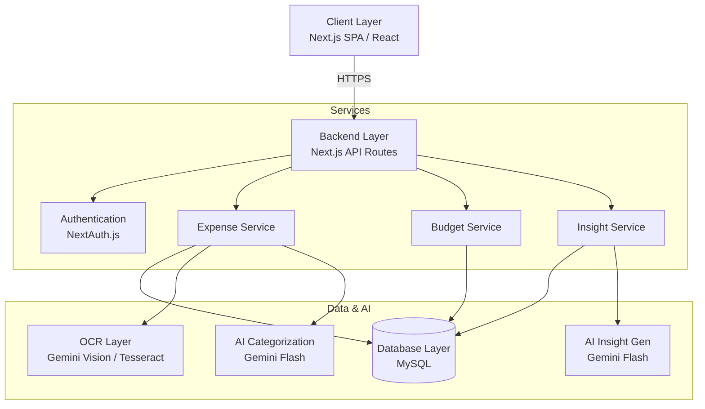
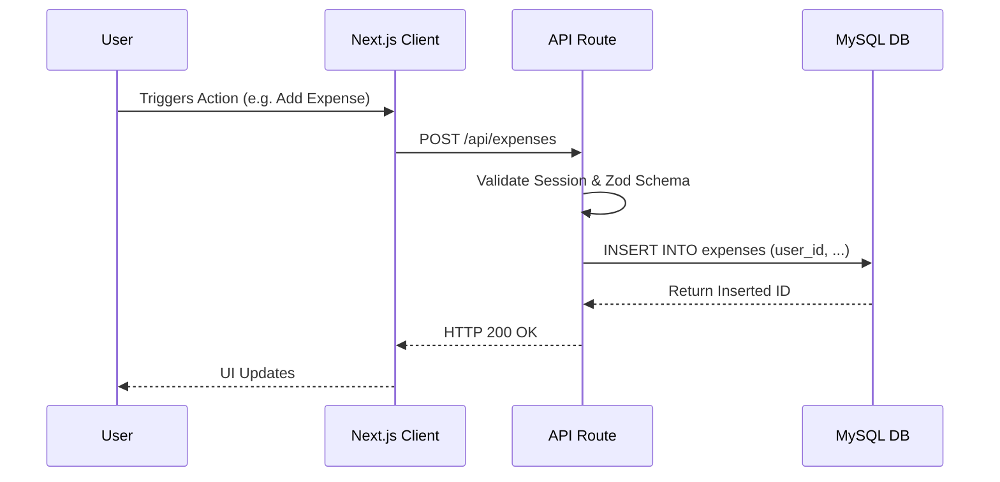
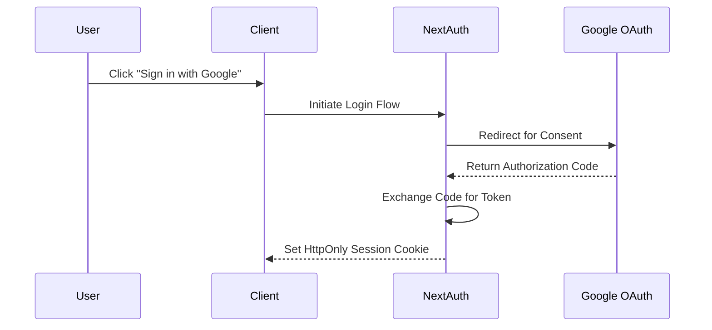
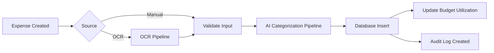
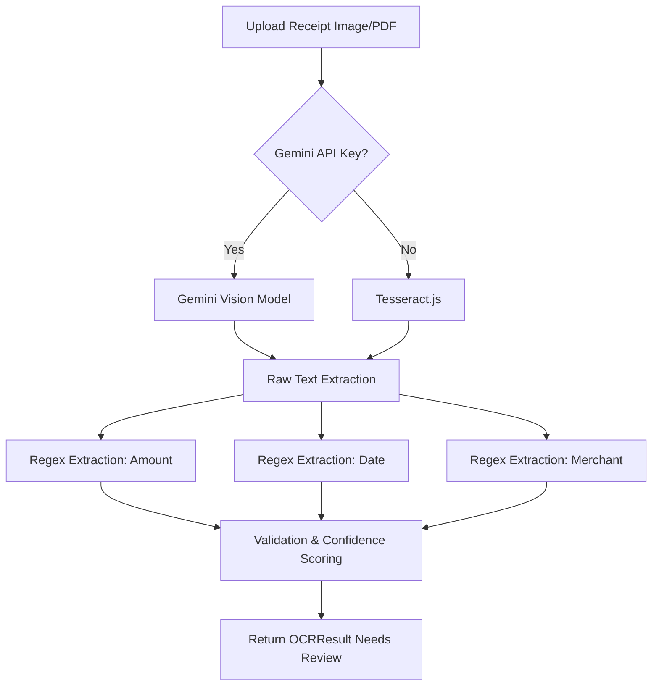
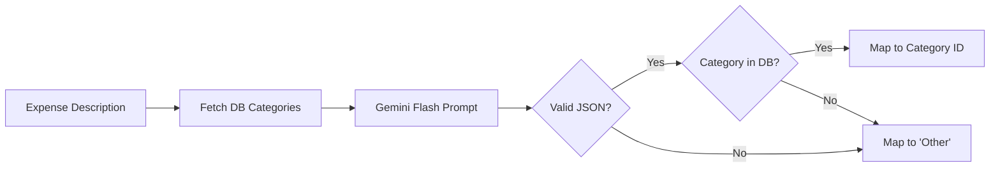
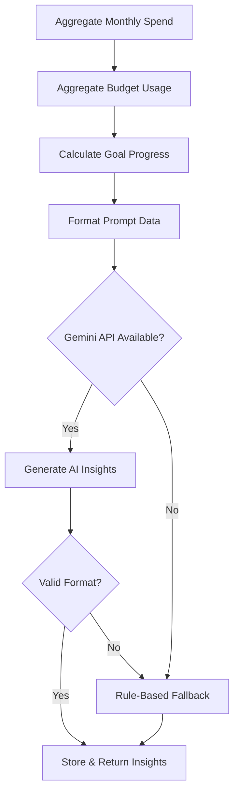
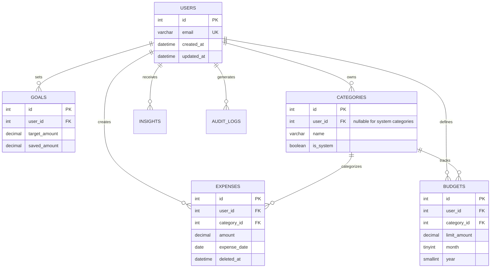

# SmartSpend

## 1. Project Overview

SmartSpend is a production-grade, SaaS-ready financial management application. It is engineered to automate expense tracking, budget enforcement, and financial goal progression. The system integrates Optical Character Recognition (OCR) and Large Language Models (LLMs) to reduce manual data entry and provide context-aware financial insights. 

## 2. Problem Statement

Personal financial management consistently suffers from high friction during data entry and low contextual value from historical data. 
- **Expense Tracking:** Manual entry is error-prone and tedious, leading to abandoned tracking.
- **Budgeting Challenges:** Static budgets fail to adapt to dynamic spending behavior.
- **Financial Awareness:** Users experience fragmented financial information across multiple bank statements and receipts.
- **Target Demographics:** Students and young professionals often lack the time or discipline for rigorous manual accounting and require automated, low-friction tools.

## 3. Proposed Solution

SmartSpend resolves these challenges through an automated, AI-assisted pipeline. 
- **Design Philosophy:** Strict data isolation, defensive programming for financial data, and graceful degradation of AI services to deterministic rules.
- **System Objectives:** Provide a unified dashboard for expenses, budgets, and goals with automated data ingestion via receipt/statement scanning.
- **User Workflow:** Users authenticate via OAuth, configure monthly budgets, and upload receipts. The system extracts transaction data, categorizes the expense, updates budget consumption, and generates predictive insights.
- **Expected Outcomes:** Reduced manual data entry time, improved budget adherence, and actionable visibility into spending trends.

## 4. System Architecture

### High-Level Architecture



### Component Responsibilities

- **Client Layer:** Handles rendering (React 19), state management, and user interactions using Radix UI components and Tailwind CSS.
- **Backend Layer:** Next.js Server Components and API routes acting as a BFF (Backend-for-Frontend), enforcing business logic and access control.
- **Database Layer:** Relational MySQL database enforcing referential integrity, multi-tenancy, and CHECK constraints for financial correctness.
- **OCR Layer:** Extracts raw text from uploaded receipts or bank statements, falling back to local Tesseract if cloud vision APIs fail.
- **AI Layer:** Analyzes parsed text to categorize expenses and generates natural language financial insights based on statistical data.
- **Authentication Layer:** NextAuth.js managing session lifecycle and OAuth (Google) integration.

## 5. Technical Architecture

### Request Lifecycle


### Authentication Workflow


### Expense Processing Pipeline


### OCR Processing Pipeline

*Note: The OCR pipeline deliberately prevents AI from inventing numbers by relying on deterministic regex parsing of the raw text output.*

### AI Categorization Pipeline


### Savings Recommendation Pipeline


## 6. Core Features

### Authentication & User Management
- **Purpose:** Secure user onboarding and data isolation.
- **Implementation:** NextAuth.js with Google OAuth. Sessions are securely stored via HttpOnly cookies.
- **Technical Considerations:** Cross-tenant data leaks are prevented by injecting `user_id` from the secure session into every database query.

### Expense Tracking
- **Purpose:** Record and manage financial outflows.
- **Implementation:** Supports manual entry and OCR-assisted uploads. Enforces positive amounts via database `CHECK` constraints.
- **Current Limitations:** Multi-currency support exists at the schema level but is largely hardcoded to INR (`₹`) in analytics logic.

### Budget Management
- **Purpose:** Enforce spending limits per category.
- **Implementation:** Allows users to set monthly limits. Canonical `month` and `year` columns ensure uniqueness via composite unique keys (`uq_budgets_user_cat_period`).

### Dashboard Analytics
- **Purpose:** Visualize financial health.
- **Implementation:** Aggregates data on the server-side to minimize client payload. Utilizes Recharts for client-side rendering.

### OCR Receipt Processing
- **Purpose:** Reduce manual data entry.
- **Implementation:** Uses Gemini Vision to extract raw text, falling back to Tesseract.js. It employs strict regex to find amounts, dates, and merchants to prevent LLM hallucination. 
- **Technical Considerations:** OCR results are flagged as `needsReview: true`, forcing user confirmation before saving to the database.

### AI Categorization
- **Purpose:** Automatically classify expenses.
- **Implementation:** Passes the expense description and allowed database categories to Gemini Flash. 
- **Current Limitations:** Vague descriptions default to "Other".

### Financial Insights
- **Purpose:** Provide actionable advice (warnings, opportunities, trends).
- **Implementation:** Gemini Flash analyzes the user's financial snapshot. Falls back to deterministic rules (e.g., "highest spending category") if the API is unreachable or fails parsing.

## 7. Technology Stack

| Layer | Technology | Purpose | Reason Selected |
|-------|------------|---------|-----------------|
| **Frontend** | Next.js 16 (App Router), React 19 | Client-side rendering and routing | Modern standard for React, optimized server/client rendering |
| **Styling** | Tailwind CSS v4, Radix UI | Component styling and accessibility | Rapid prototyping, headless unstyled accessible primitives |
| **Backend** | Next.js API Routes / Server Actions | API endpoints and server logic | Unified full-stack repository, seamless TypeScript sharing |
| **Database** | MySQL (via `mysql2`) | Persistent data storage | Strict relational integrity, transaction support, scalable |
| **Auth** | NextAuth.js (v4) | Authentication | Standardized OAuth integration, robust session handling |
| **AI Services** | Google Gemini 1.5 Flash | OCR & Categorization | Low latency, cost-effective multimodal capabilities |
| **OCR Fallback** | Tesseract.js, pdf-parse | Local text extraction | Graceful degradation if cloud AI is unavailable |
| **Validation** | Zod | Schema validation | Type-safe runtime parsing of API payloads and AI outputs |

## 8. Database Design

The database employs a strict multi-tenant architecture. Every tenant-specific table contains a `user_id` foreign key.

### ER Diagram


### Schema Overview
- **`users`**: Enforces unique emails and mandatory timestamps.
- **`categories`**: Uses `is_system` and allows `user_id = NULL` for global categories. A composite unique key (`user_id`, `name`) prevents duplicate categories per user.
- **`expenses`**: Implements soft-deletes (`deleted_at`) and enforces `amount > 0` via CHECK constraints. Includes an `audit_log` table for compliance tracking.
- **`budgets`**: Ensures users can only have one budget per category per month via a composite unique key.
- **`goals`**: Tracks savings targets with constraints ensuring `target_amount > 0` and `saved_amount >= 0`.

## 9. OCR Processing Pipeline

The OCR pipeline prioritizes safety and determinism over pure AI autonomy.

1. **Upload:** User uploads an image or PDF.
2. **Extraction:** The system calls Gemini 1.5 Flash with strict instructions to output *raw text only*. If this fails, it falls back to local `Tesseract.js` or `pdf-parse`.
3. **Regex Parsing:** Custom regex routines scan the raw text to locate the largest currency amount, standard date formats, and likely merchant names.
4. **Validation:** The system assigns a confidence score (`high`, `medium`, `low`) based on regex match quality.
5. **Review:** The system explicitly flags the result for manual user review. No OCR data is saved directly to the database without human confirmation.

## 10. AI Integration

The system leverages Google's Gemini 1.5 Flash for its speed and multimodal capabilities.

- **Categorization:** Maps expense descriptions to predefined database categories.
- **Insight Generation:** Evaluates spending velocity against budgets to warn users of overspending or highlight savings opportunities.

**Technical Considerations & Limitations:**
- **Hallucination Risk:** Mitigated by forcing JSON schema outputs and using strict backend validation (Zod). 
- **OCR Number Fabrication:** The AI is intentionally blocked from guessing amounts during OCR; it only provides the transcription, leaving number extraction to regex.
- **Failure Modes:** If the Gemini API times out (set to 6000ms), 404s, or returns invalid JSON, the system gracefully degrades. Categorization defaults to "Other", and Insights fall back to deterministic, rule-based calculations (e.g., highlighting the highest mathematical spend).

## 11. Design Decisions and Trade-offs

- **MySQL vs NoSQL:** Financial applications require strict ACID properties, foreign key constraints, and relational integrity. MySQL was chosen over MongoDB to prevent orphaned records (e.g., expenses tied to deleted categories).
- **OCR + Regex vs AI-Only:** While LLMs can extract structured JSON directly from receipts, they are prone to hallucinating tax numbers or subtotals as the final amount. Using the LLM strictly as an OCR transcription tool and regex for data extraction guarantees deterministic numerical handling.
- **Server-Side Auth:** NextAuth handles sessions server-side via HttpOnly cookies, mitigating XSS risks associated with storing JWTs in `localStorage`.

## 12. Security Considerations

- **Authorization:** Every API route verifies the NextAuth session. The `user_id` is extracted from the trusted server session, never trusted from the client payload.
- **Data Isolation:** SQL queries are explicitly scoped with `WHERE user_id = ?`.
- **SQL Injection:** The `mysql2` driver is used with parameterized queries to prevent SQL injection.
- **Input Validation:** Zod schemas validate all incoming API payloads before database interaction.
- **Audit Logging:** An `audit_logs` table tracks sensitive modifications to expense records.

## 13. Scalability Considerations

- **Current Architecture:** Monolithic Next.js application backed by a single MySQL instance.
- **Database Scaling:** The schema is optimized with composite covering indexes (e.g., `idx_expenses_user_date`, `idx_budgets_user_period_canonical`) to support fast analytical queries for the dashboard.
- **Future Evolution:** The AI and OCR processing pipelines are stateless and can be offloaded to serverless queues or background workers if processing volume increases.

## 14. Current Limitations

- **OCR Accuracy:** Highly dependent on lighting, blur, and receipt formatting. Handwritten receipts perform poorly.
- **AI Categorization Uncertainty:** Niche or vague descriptions (e.g., "Amazon") lack context to differentiate between groceries or electronics, often resulting in fallback categorizations.
- **Currency Support:** The database schema supports a `currency_code`, but frontend analytics and AI prompts currently default heavily to INR (`₹`).
- **File Storage:** Uploaded files are processed in memory and discarded; there is no persistent blob storage for historical receipt viewing.

## 15. Future Roadmap

- **Short-Term:** Implement fully dynamic multi-currency support across all analytics and AI prompts. Add persistent Blob storage (e.g., AWS S3) for receipt images.
- **Medium-Term:** Integrate Plaid or similar banking APIs for automated transaction ingestion, reducing reliance on manual OCR.
- **Long-Term:** Implement advanced forecasting models utilizing historical time-series data to predict end-of-month cash flow.

## 16. Research and Academic Context

- Based on the SmartSpend research paper.
- Accepted for publication in the **ICGMRFT 2026** proceedings.
- Recognized as an **IEEE YESIST12 2026 International Finalist**.

## 17. Local Development Setup

### Prerequisites
- Node.js (v22+)
- MySQL (v8.0+)
- Google Cloud Console Account (for OAuth & Gemini)

### Installation
```bash
git clone <repository-url>
cd smartspend
npm install
```

### Environment Variables
Copy `.env.example` to `.env.local` and populate the required keys:
```bash
# Database Configuration
DB_HOST=localhost
DB_PORT=3306
DB_USER=root
DB_PASSWORD=your_password
DB_NAME=smartspend

# NextAuth
NEXTAUTH_URL=http://localhost:3000
NEXTAUTH_SECRET=your_generated_secret

# Google OAuth
GOOGLE_CLIENT_ID=your_google_client_id
GOOGLE_CLIENT_SECRET=your_google_client_secret

# AI API Keys
GEMINI_API_KEY=your_gemini_api_key
```

### Database Setup
Execute the migrations in sequential order against your MySQL database:
```bash
mysql -u root -p smartspend < db/migrations/001_safe_schema_fix.sql
# Repeat for all migration files in order, or run the consolidated script
mysql -u root -p smartspend < all_migrations.sql
```

### Running Locally
```bash
npm run dev
```
Navigate to `http://localhost:3000`.

## 18. Project Structure

```text
smartspend/
├── app/               # Next.js App Router (Pages, API Routes, Layouts)
├── components/        # Reusable React components (Radix UI, Tailwind)
├── db/                # MySQL schema definitions and migration scripts
├── lib/               # Core business logic, AI engines, OCR pipeline
│   ├── ai/            # Gemini Flash integrations (Categorization, Insights)
│   ├── ocr/           # Gemini Vision and Tesseract extraction logic
│   ├── auth/          # NextAuth configuration
│   └── finance/       # Analytical calculation utilities
├── services/          # Data access layer for database entities
├── public/            # Static assets
└── tests/             # Vitest configuration and test suites
```

## 19. Conclusion

SmartSpend demonstrates a robust, production-ready implementation of a modern financial management tool. By prioritizing strict relational data integrity, enforcing multi-tenant isolation, and utilizing LLMs defensively via strict parsing and fallback mechanisms, the architecture minimizes the unreliability typically associated with AI integrations in financial contexts. The project serves as a scalable foundation for automated personal finance.
