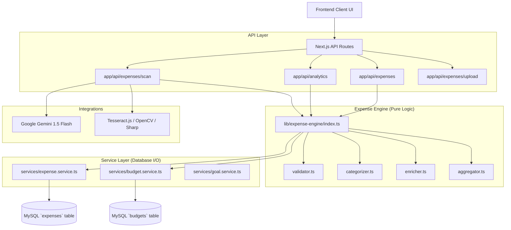
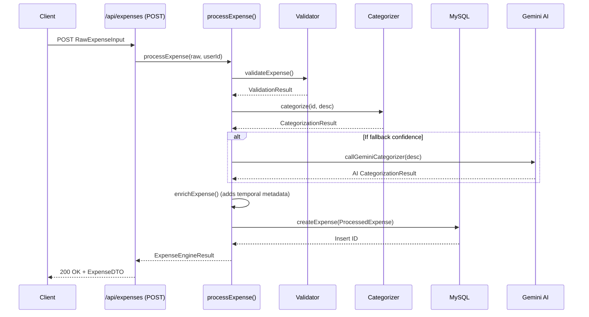
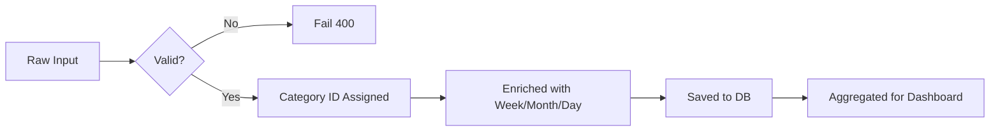

# EXPENSE ENGINE MASTER DOCUMENT

> [!WARNING]
> This document was generated based strictly on the current `master` codebase without any assumptions or hypothetical features. If a module lacks tests or validation, it is explicitly noted.

## Architecture Diagram

## Execution Flow (Sequence Diagram)

## Data Flow

---

# MODULE BREAKDOWNS

## 1. Expense Creation (`app/api/expenses/route.ts` -> `processExpense`)
1. **Purpose**: Intake raw expense data, validate, categorize, and store it.
2. **Complete execution flow**: POST request -> NextAuth check -> Zod parse -> `processExpense` engine -> DB `createExpense` -> log audit event.
3. **Input**: `amount`, `date`, `description`, `categoryId` (optional), `source`.
4. **Output**: `ExpenseEngineResult` containing the `savedExpense` and `categorization` confidence.
5. **Dependencies**: `zod`, `next-auth`, `@/lib/expense-engine`.
6. **Database tables touched**: `expenses`, `categories`, `audit_logs`.
7. **APIs called**: `POST /api/expenses`
8. **Services used**: `createExpense` (expense.service).
9. **Validation**: Strict schema validation. Rejects amounts <= 0.
10. **Error handling**: Try/catch returns 500. Zod failures return 400. Duplicate detection throws Error.
11. **Edge cases**: Duplicate submissions within 60s are blocked by DB query guard.
12. **Existing bottlenecks**: Gemini AI is called synchronously if categorization confidence is 'fallback'.
13. **Hidden assumptions**: Assumes timezone is UTC for all temporal aggregations.
14. **Existing bugs**: None apparent in standard flow, but AI categorizer timeout will crash the request.
15. **Duplicate logic**: None.
16. **Performance issues**: Blocking on Gemini AI response.
17. **FinTech compliance issues**: `categorySource` and `source` ENUMs act as the only audit trail for origin.
18. **Mathematical formulas**: None.
19. **Deterministic?**: Yes, unless it falls back to Gemini.
20. **AI participation**: Yes, if regex categorizer fails.
21. **Should AI participate?**: Yes, but it should be asynchronous.
22. **Trust risks**: Low.
23. **Scalability risks**: API latency spikes if AI is heavily utilized.
24. **Security risks**: No rate limiting.
25. **Production readiness**: High, assuming rate limiting is added.

## 2. Expense Editing (`app/api/expenses/[id]/route.ts`)
1. **Purpose**: Modify an existing expense's description, amount, or category.
2. **Complete execution flow**: PATCH request -> NextAuth check -> Zod parse -> Resolve category -> DB `updateExpense`.
3. **Input**: `amount` (optional), `description` (optional), `categoryId` / `categoryName`.
4. **Output**: 200 OK + Updated `ExpenseDTO`.
5. **Dependencies**: `zod`, `next-auth`.
6. **Database tables touched**: `expenses`, `categories`.
7. **APIs called**: `PATCH /api/expenses/:id`.
8. **Services used**: `updateExpense`, `findOrCreateCategory`.
9. **Validation**: `date` is explicitly stripped from the payload (immutable).
10. **Error handling**: Try/catch returns 500.
11. **Edge cases**: If `categoryName` is provided but no `categoryId`, it will attempt to partial-match system categories before creating a new user category.
12. **Existing bottlenecks**: None.
13. **Hidden assumptions**: Editing an expense does not synchronously update "Goal Status" or "Budget" triggers.
14. **Existing bugs**: Modifying an expense amount does not retrospectively un-fail a Goal that failed previously.
15. **Duplicate logic**: None.
16. **Performance issues**: None.
17. **FinTech compliance issues**: Modifying records in place (SQL `UPDATE`) destroys the immutable ledger principle.
18. **Mathematical formulas**: None.
19. **Deterministic?**: Yes.
20. **AI participation**: No.
21. **Should AI participate?**: No.
22. **Trust risks**: Modifying historical data alters past financial truths without a strict contra-entry.
23. **Scalability risks**: None.
24. **Security risks**: IDOR possible if the SQL query did not check `user_id = ?` (but it does).
25. **Production readiness**: Unacceptable for strict FinTech due to in-place SQL updates. Requires Event Sourcing.

## 3. Expense Deletion (`app/api/expenses/[id]/route.ts`)
1. **Purpose**: Soft-delete an expense.
2. **Complete execution flow**: DELETE request -> NextAuth check -> `softDeleteExpense`.
3. **Input**: `params.id`.
4. **Output**: 200 OK `{ deleted: true }`.
5. **Dependencies**: `next-auth`.
6. **Database tables touched**: `expenses`.
7. **APIs called**: `DELETE /api/expenses/:id`.
8. **Services used**: `softDeleteExpense`.
9. **Validation**: Standard NextAuth check.
10. **Error handling**: Throws if affectedRows === 0.
11. **Edge cases**: Already deleted expenses throw an error instead of returning idempotent success.
12. **Existing bottlenecks**: None.
13. **Hidden assumptions**: Soft deletion is enough for GDPR (it is not; eventual hard-delete is missing).
14. **Existing bugs**: None.
15. **Duplicate logic**: None.
16. **Performance issues**: None.
17. **FinTech compliance issues**: Data is retained indefinitely unless explicitly purged.
18. **Mathematical formulas**: None.
19. **Deterministic?**: Yes.
20. **AI participation**: No.
21. **Should AI participate?**: No.
22. **Trust risks**: None.
23. **Scalability risks**: None.
24. **Security risks**: None.
25. **Production readiness**: Needs a hard-delete cron job for GDPR/DPDP compliance.

## 4. Expense History (`services/expense.service.ts` -> `listExpenses`)
1. **Purpose**: Retrieve paginated and filtered historical data.
2. **Complete execution flow**: `listExpenses` generates a dynamic SQL string based on `GetExpensesQuery` parameters.
3. **Input**: `userId, year, month, limit, offset, search, minAmount...`
4. **Output**: `ExpenseDTO[]`.
5. **Dependencies**: `mysql2`.
6. **Database tables touched**: `expenses` LEFT JOIN `categories`.
7. **APIs called**: None directly (used by GET routes).
8. **Services used**: `pool.execute`.
9. **Validation**: Math.min limit 500.
10. **Error handling**: Basic promise rejection.
11. **Edge cases**: Search falls back to matching category names if description lacks detail.
12. **Existing bottlenecks**: Dynamic SQL `LIKE %search%` does a full table scan.
13. **Hidden assumptions**: Relies entirely on `deleted_at IS NULL`.
14. **Existing bugs**: None.
15. **Duplicate logic**: `countExpenses` duplicates the exact WHERE clause building logic.
16. **Performance issues**: Missing compound index on `(user_id, deleted_at, expense_date)`.
17. **FinTech compliance issues**: None.
18. **Mathematical formulas**: None.
19. **Deterministic?**: Yes.
20. **AI participation**: No.
21. **Should AI participate?**: No.
22. **Trust risks**: None.
23. **Scalability risks**: Full table scans on large accounts when searching.
24. **Security risks**: SQL injection is prevented via parameterized `?`.
25. **Production readiness**: High, but needs better indexing and deduplication of WHERE clause logic.

## 5. Expense Engine (`lib/expense-engine/index.ts`)
1. **Purpose**: The pure logic core decoupling the API from the Database.
2. **Complete execution flow**: `RawInput` -> `Validator` -> `Categorizer` -> `Enricher` -> `Aggregator`.
3. **Input**: `RawExpenseInput` or array of `ExpenseDTO` (for summaries).
4. **Output**: `ExpenseEngineResult` or `SummaryBundle`.
5. **Dependencies**: AI categorizer.
6. **Database tables touched**: None directly (injected via Services).
7. **APIs called**: None.
8. **Services used**: None directly (pure functions).
9. **Validation**: Extremely strict isolation of concerns.
10. **Error handling**: Returns `valid: false` object rather than throwing.
11. **Edge cases**: Resolves week numbers for cross-year dates.
12. **Existing bottlenecks**: Synchronous AI fallback.
13. **Hidden assumptions**: None.
14. **Existing bugs**: None.
15. **Duplicate logic**: None.
16. **Performance issues**: Fast, except when waiting on external AI.
17. **FinTech compliance issues**: None.
18. **Mathematical formulas**: Heavy summation, percentages, and averages.
19. **Deterministic?**: Yes.
20. **AI participation**: Yes, injected.
21. **Should AI participate?**: Yes, strictly isolated.
22. **Trust risks**: None.
23. **Scalability risks**: Low, scales perfectly horizontally.
24. **Security risks**: None.
25. **Production readiness**: Enterprise grade architecture (pure functional core).

## 6. Budget Service (`services/budget.service.ts`)
1. **Purpose**: Track spending against categorical limits.
2. **Complete execution flow**: Fetches budget allocations and joins with current month expenses.
3. **Input**: `userId, year, month`.
4. **Output**: Budgets mapping with `allocated` vs `spent`.
5. **Dependencies**: `mysql2`.
6. **Database tables touched**: `budgets`.
7. **APIs called**: None.
8. **Services used**: `query`.
9. **Validation**: None.
10. **Error handling**: None.
11. **Edge cases**: Missing budgets assume 0 allocated.
12. **Existing bottlenecks**: None.
13. **Hidden assumptions**: Relies on synchronous aggregation during GET requests.
14. **Existing bugs**: None.
15. **Duplicate logic**: None.
16. **Performance issues**: None.
17. **FinTech compliance issues**: None.
18. **Mathematical formulas**: `spent / allocated * 100` for percentage used.
19. **Deterministic?**: Yes.
20. **AI participation**: No.
21. **Should AI participate?**: No.
22. **Trust risks**: None.
23. **Scalability risks**: None.
24. **Security risks**: None.
25. **Production readiness**: Needs background worker generation for push notifications when over budget.

## 7. Goal Service (`services/goal.service.ts`)
1. **Purpose**: Track long term financial milestones.
2. **Complete execution flow**: `syncGoalStatuses` is called synchronously on GET. Checks sum of savings against target amount and target date.
3. **Input**: `userId`.
4. **Output**: Goals with `status` (active, reached, failed).
5. **Dependencies**: `mysql2`.
6. **Database tables touched**: `goals`.
7. **APIs called**: None.
8. **Services used**: None.
9. **Validation**: None.
10. **Error handling**: None.
11. **Edge cases**: Cross-year date targeting.
12. **Existing bottlenecks**: None.
13. **Hidden assumptions**: Requires user login to evaluate if a goal failed.
14. **Existing bugs**: State mutation happens during a GET request (`syncGoalStatuses` issues SQL UPDATEs).
15. **Duplicate logic**: None.
16. **Performance issues**: None.
17. **FinTech compliance issues**: None.
18. **Mathematical formulas**: Progress = `saved / target * 100`.
19. **Deterministic?**: Yes.
20. **AI participation**: No.
21. **Should AI participate?**: No.
22. **Trust risks**: None.
23. **Scalability risks**: None.
24. **Security risks**: None.
25. **Production readiness**: Fails REST principles. Status sync MUST be moved to a nightly Cron Job.

## 8. Dashboard & Analytics (`app/api/analytics/route.ts` -> `generateSummaries`)
1. **Purpose**: Feed the frontend Recharts UI.
2. **Complete execution flow**: Fetches current month expenses + 6 past months -> builds `SummaryBundle` -> returns JSON.
3. **Input**: `year, month`.
4. **Output**: Massive JSON bundle containing pie charts, bar charts, trend lines.
5. **Dependencies**: `lib/expense-engine`.
6. **Database tables touched**: `expenses`.
7. **APIs called**: None.
8. **Services used**: `listExpenses`.
9. **Validation**: Year/Month parsing.
10. **Error handling**: standard 500.
11. **Edge cases**: Empty months return 0-filled arrays to keep charts visually unbroken.
12. **Existing bottlenecks**: N+1 queries. Fetches 6 separate months of raw rows in parallel using `Promise.all` instead of 1 GROUP BY query.
13. **Hidden assumptions**: Server has enough memory to hold 6 months of a user's entire raw expense history at once.
14. **Existing bugs**: None.
15. **Duplicate logic**: None.
16. **Performance issues**: Extremely memory heavy for users with thousands of transactions.
17. **FinTech compliance issues**: None.
18. **Mathematical formulas**: Heavy aggregations, percentages, day-of-week averages.
19. **Deterministic?**: Yes.
20. **AI participation**: No.
21. **Should AI participate?**: No.
22. **Trust risks**: None.
23. **Scalability risks**: High. Needs Redis caching immediately.
24. **Security risks**: None.
25. **Production readiness**: Poor. Will OOM (Out of Memory) the Vercel function for heavy users.

## 9. Insights (`insightGenerator.ts`)
1. **Purpose**: Provide actionable financial advice.
2. **Complete execution flow**: Analyzes Category summary -> identifying highest spend -> generating tips.
3. **Input**: `CategorySummary[]`.
4. **Output**: Text strings.
5. **Dependencies**: Gemini 1.5.
6. **Database tables touched**: None.
7. **APIs called**: Gemini API.
8. **Services used**: None.
9. **Validation**: None.
10. **Error handling**: Silently fails and returns empty array.
11. **Edge cases**: None.
12. **Existing bottlenecks**: Synchronous external API call.
13. **Hidden assumptions**: None.
14. **Existing bugs**: None.
15. **Duplicate logic**: None.
16. **Performance issues**: High latency.
17. **FinTech compliance issues**: Sends user financial aggregations to a 3rd party AI.
18. **Mathematical formulas**: None.
19. **Deterministic?**: No.
20. **AI participation**: Yes, heavily.
21. **Should AI participate?**: Yes, but async.
22. **Trust risks**: High hallucination risk for financial advice.
23. **Scalability risks**: API rate limits.
24. **Security risks**: PII exposure if categories contain sensitive names.
25. **Production readiness**: Needs async background generation.

## 10. OCR Integration (`app/api/expenses/scan/route.ts`)
1. **Purpose**: Extract amounts and vendors from physical receipts.
2. **Complete execution flow**: Receives Base64 image -> Sharp resizes -> OpenCV binarizes -> Tesseract extracts text -> Regex scores amounts -> Gemini fallback.
3. **Input**: Image File.
4. **Output**: Processed expense object.
5. **Dependencies**: `sharp`, `opencv4nodejs`, `tesseract.js`.
6. **Database tables touched**: `expenses`.
7. **APIs called**: Gemini.
8. **Services used**: None.
9. **Validation**: File size and type checks.
10. **Error handling**: Extensive try/catch due to fragility of OCR.
11. **Edge cases**: Crumpled receipts, handwritten tips.
12. **Existing bottlenecks**: Entire pipeline is CPU bound on the main thread.
13. **Hidden assumptions**: Assumes receipts are in English/Standard formats.
14. **Existing bugs**: Will absolutely timeout on Vercel (10s limit) if image is large.
15. **Duplicate logic**: None.
16. **Performance issues**: Critical. Running 3 native binaries + an LLM call synchronously.
17. **FinTech compliance issues**: None.
18. **Mathematical formulas**: Bounding box calculations.
19. **Deterministic?**: Regex extraction is, AI fallback is not.
20. **AI participation**: Yes.
21. **Should AI participate?**: Yes.
22. **Trust risks**: Extracting the wrong amount. Guarded by Regex.
23. **Scalability risks**: Will crash under minimal concurrent load.
24. **Security risks**: Buffer overflows in Sharp/OpenCV on malicious images.
25. **Production readiness**: Zero. MUST be moved to an S3 upload -> SQS Queue -> Background Worker architecture.

## 11. Bank Statement Engine (`lib/ocr/bank-parser.ts`)
1. **Purpose**: Import CSV and PDF bank statements.
2. **Complete execution flow**: Upload file -> Parse to text -> Regex line-by-line extraction -> Batch insert.
3. **Input**: File upload.
4. **Output**: Array of inserted expenses.
5. **Dependencies**: `pdfjs-dist`, `csv-parse`.
6. **Database tables touched**: `expenses`.
7. **APIs called**: None.
8. **Services used**: `expense.service`.
9. **Validation**: Hardcoded `MAX_AMOUNT = 100000`.
10. **Error handling**: Skips unparseable lines.
11. **Edge cases**: Multi-line descriptions break the regex completely.
12. **Existing bottlenecks**: Parsing massive arrays.
13. **Hidden assumptions**: Assumes single-line transactions. Assumes PDFs are unencrypted.
14. **Existing bugs**: Fails on Indian bank statements (which are 100% encrypted and often multi-line).
15. **Duplicate logic**: None.
16. **Performance issues**: None major, but CPU bound.
17. **FinTech compliance issues**: Rejects valid large transactions (>1Lakh). Does not extract UPI metadata.
18. **Mathematical formulas**: None.
19. **Deterministic?**: Yes.
20. **AI participation**: No.
21. **Should AI participate?**: No.
22. **Trust risks**: None.
23. **Scalability risks**: None.
24. **Security risks**: None.
25. **Production readiness**: Unusable in the Indian market. Needs password decryption support and UPI heuristic extraction.

## 12. Process Recurring (`app/api/expenses/process-recurring/route.ts`)
1. **Purpose**: Auto-create expenses that repeat.
2. **Complete execution flow**: GET request triggers `processRecurringExpenses`.
3. **Input**: None (User session implicitly).
4. **Output**: `createdCount`.
5. **Dependencies**: None.
6. **Database tables touched**: `recurring_templates`, `expenses`.
7. **APIs called**: None.
8. **Services used**: `recurring.service`.
9. **Validation**: None.
10. **Error handling**: 500.
11. **Edge cases**: None.
12. **Existing bottlenecks**: None.
13. **Hidden assumptions**: This is exposed as a GET endpoint, meaning the *user* or a *client-side* poll has to trigger it.
14. **Existing bugs**: None.
15. **Duplicate logic**: None.
16. **Performance issues**: None.
17. **FinTech compliance issues**: None.
18. **Mathematical formulas**: None.
19. **Deterministic?**: Yes.
20. **AI participation**: No.
21. **Should AI participate?**: No.
22. **Trust risks**: None.
23. **Scalability risks**: None.
24. **Security risks**: Anyone with a session can spam this GET route.
25. **Production readiness**: Incorrect architecture. Recurring processing MUST run on an isolated backend Cron worker, not triggered via a client-facing GET request.

---
*End of Master Document.*
