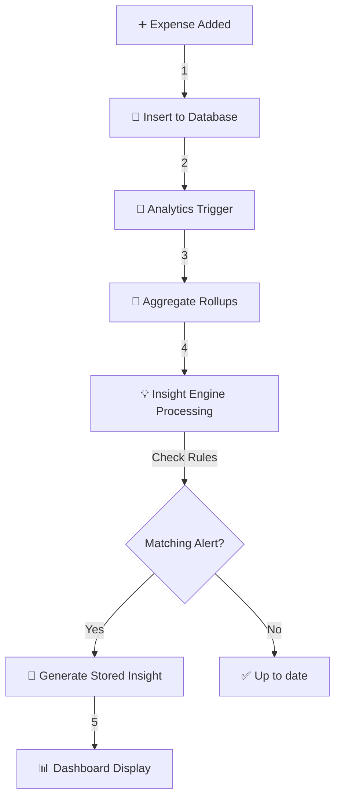

# SmartSpend Analytics Engine Documentation

The **SmartSpend Analytics Engine** is the intelligence layer layer calculating spending velocity, forecast triggers, and converting transactions into actionable financial insights.

---

## ⚙️ 1. Core Functions

### 📊 Expense Aggregation
*   **Period Grouping:** Automatically sums transactional volume grouped by `Day`, `Week`, or `Month` intervals.
*   **Category Rollups:** Divides total velocity across system classifications (e.g., Food, Transport) dynamically comparing against budget bounds setups securely.

### 📈 Spending Pattern Analysis
*   **WoW/MoM Trends:** Compares standard period buffers to prior averages finding multipliers (e.g., spending inflated 15% vs week prior).
*   **Averages Smoothing Tracking buffers**: Computes static mean divisors establishing a "normal range" for individual tenants.

---

## 🧠 2. Rule-Based Insights Algorithm

The engine passes loaded metrics into isolated conditional filters to create notifications. 

### 🚨 Example Alert Rule
*   **Condition:** Spending in a Category `> 25%` of total budget context.
*   **Logic:**
    ```typescript
    if (spentAmount > budgetLimit * 0.25) {
      createInsight('budget_exceeded', `You've used ${spentPct}% of your ${category} cap.`);
    }
    ```

### 📈 Example Trend Rule
*   **Condition:** Expense volume expands consecutively for 3 consecutive weeks.
*   **Logic:**
    ```typescript
    if (week3 > week2 && week2 > week1) {
      createInsight('overspending_alert', 'Your spending has increased 3 weeks in a row.');
    }
    ```

---

## 🔄 3. Analytics Lifecycle Pipeline 

The lifecycle aggregates events async and hydrates standard page buffers correctly:



### 🔁 Pipeline Breakdown

1.  **Input Triggers**: User creates expense manual inputs or imports.
2.  **Validation processing**: SQL row locks transaction details securely.
3.  **Aggregate hydrated buffers**: Core services run unified aggregates finding multipliers thresholds caps.
4.  **Rules checking bounds**: Matches thresholds compared against thresholds configurations bounds scaling thresholds natively.
5.  **Output Display mappings**: Aggregates render layouts correctly mappings context thresholds context layouts properly setups securely.

---
*Updated: March 2026*
