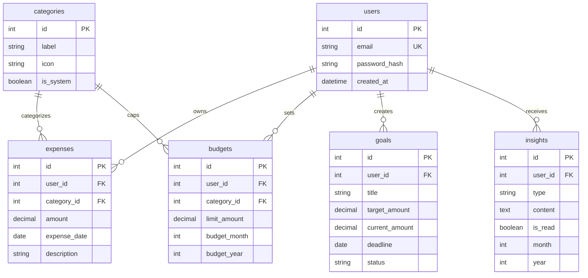

# SmartSpend Database Schema Documentation

SmartSpend uses a relational **MySQL database** structured for multi-tenant SaaS environments. 

---

## 📐 1. Database Entity Relationships

The schema revolves around the `users` table, which serves as the tenant boundary anchoring all analytics data.



---

## 🗄️ 2. Detailed Table Specifications

### 👤 Users
*   Anchor for isolation. Contains authentication identifiers.
*   *Key Columns:* `id` (PK, AutoIncrement), `email` (VARCHAR 255, Unique).

### 🏷️ Categories
*   Static lookup table for classifying transactions (e.g., Food, Transport).
*   *Key Columns:* `id` (PK), `label` (VARCHAR), `is_system` (BOOLEAN).

### 💸 Expenses
*   Main transaction ledger.
*   *Key Columns:* `user_id` (FK), `category_id` (FK), `amount` (DECIMAL 10,2), `expense_date` (DATE).

### 📊 Budgets
*   Stores monthly category expenditure thresholds.
*   *Key Columns:* `user_id` (FK), `category_id` (FK), `limit_amount` (DECIMAL 10,2), `budget_month` (INT), `budget_year` (INT).
*   *Unique Constraint:* `UNIQUE KEY (user_id, category_id, budget_month, budget_year)` ensures no duplicates per period.

### 🎯 Goals
*   Monitors savings milestones.
*   *Key Columns:* `user_id` (FK), `target_amount` (DECIMAL 10,2), `deadline` (DATE), `status` (ENUM / VARCHAR).

### 💡 Insights
*   Notifications/advice generated by analytics rules engine.
*   *Key Columns:* `user_id` (FK), `type` (VARCHAR), `content` (TEXT), `is_read` (BOOLEAN).

---

## 🔒 3. Multi-User SaaS Isolation (Row-Level Security)

SmartSpend enforces **strict logical isolation** to prevent cross-tenant leaks:

1.  **Anchoring:** Every table (except template lookups) features a `user_id` foreign key.
2.  **Explicit Filtering:** All service queries include a mandatory `WHERE user_id = ?` clause derived directly from securely parsed session variables.
3.  **Input Sanitation:** User identifiers are validated at boundary layer entries solvers (e.g., Zod schemas serverside parsing absolute filters).

---

## ⚡ 4. Recommended Index Strategy

Indexes prevent queries from degrading under SaaS scaling loads:

*   **Expenses Range Filtering Rollups:**
    ```sql
    INDEX idx_expenses_user_date (user_id, expense_date)
    ```
    *Speed up dashboards that load monthly breakdowns.*

*   **Category Rollups Queries:**
    ```sql
    INDEX idx_expenses_category (user_id, category_id)
    ```
    *Handles grouping summaries faster.*

*   **Insights deduplication triggers:**
    ```sql
    UNIQUE INDEX uq_insight_period (user_id, type, month, year)
    ```
    *Guarantees Idempotence across continuous runs.*

---
*Updated: March 2026*
